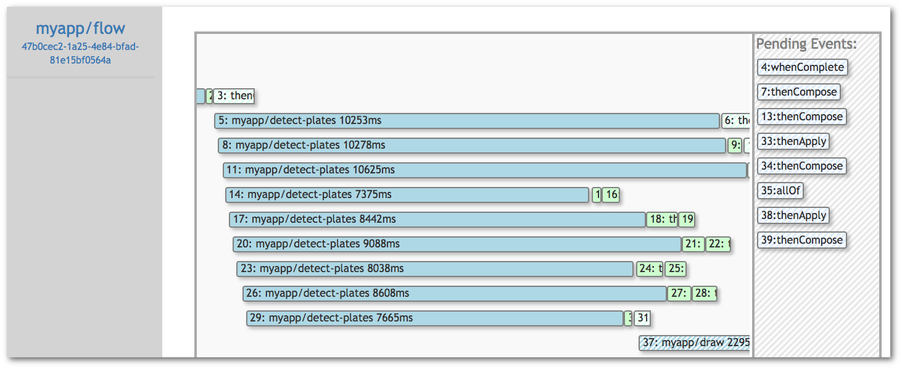

*WARNING* Fn Flow is an experimental feature please get in touch on [Fn Slack](https://fnproject.slack.com/join/shared_invite/MjIwNzc5MTE4ODg3LTE1MDE0NTUyNTktYThmYmRjZDUwOQ)  if you are interesrted in contributing to/using it. 

# Fn Flow


[](https://circleci.com/gh/fnproject/flow)
[](https://godoc.org/github.com/fnproject/flow)
[](https://goreportcard.com/report/github.com/fnproject/flow)

Fn Flow lets you build long-running, reliable and scalable functions using [Fn](https://github.com/fnproject/fn) that only consume compute resources when they have work to do and are written purely in code.  Flow supports building complex parallel processes that are readable, testable (including via unit testing) using standard programming tools. Flow empowers you to build workflows as distributed programs that are as complex as you need them to be and supports a rich set of concurrency primitives including fork-join, chaining, delays and error handling. 


## How Fn Flow is different from other workflow tools

Most workflow systems strongly separate the coordination of a process from its execution, typically using declarative workflow programming languages like state machines to execute the workflow in one system and the units of work (e.g. steps, stages) in another. 
 
This creates several new problems that Fn Flow aims to overcome: 

* *Two languages, two sets of tools* : As a software engineer you are already likely to be skilled at solving problems using existing programming languages and tools;  requiring you to spontaneously move to a different paradigm and language just to distribute your process is hard work and slows you down. We think this context-switching is harmful and Flow is designed to let you stick to the languages and tools that you already know to quickly add features.  
* *Restricted Semantics* : While workflow languages are programming languages like any other, they typically do not have the same semantics as the languages you would use for other tasks, forcing you to reduce your process to something that fits in the semantic model of the workflow system. For state machine type systems this is often problematic as processes grow in complexity.  The number of links between states can result in more programming errors and programs that are hard to read and reason about. Flow allows you to code in existing languages (like Java) and use existing code to implement your process.
* *Error handling* : In the cloud, processes often need to handle and recover from failures in other systems, this recovery is frequently more complex than just trying again a few more times. Flow exposes these errors in a similar way to exceptions allowing you to handle, recover and take action as you see fit - including running more code to resolve the issue.  
* *Glue code and context* : Workflow systems are frequently used to orchestrate independent, heterogeneous tasks together. On paper this sounds simple, just drag and drop the tasks into a graph and run the code, right? In practice one task is unlikely to to take exactly the same input as another tasks output (if they did they would not be be very independent!). Tasks may also need context data from other tasks that executed before the previous step. In current workflow languages this often results in you having to add new tasks to translate data from one task to another and introduce complex data handling to pass context around. Flow allows you to use the language features of an existing programming language - glue code can be expressed using (e.g.) Java methods and expressions - without sacrificing type-safety.


## For example... 

The following Java Fn Flow function coordinates five  other functions to:
 
1. Scrape results for an image search (using the `scraper` function)
2. In parallel, detect number plates in each image in the results (using `detect-plates`), 
3. For each detected plate, draw the location of the plate on the image (`draw`) then send an alert containing the rendered image (`alert`)
5. Wait for the process to finish and then send a completion message (`complete`)

```java
public void handleRequest(ScrapeReq input) throws Exception {
   FlowFuture<ScrapeResp> scrapes = currentFlow().invokeFunction("./scraper", input, ScrapeResp.class);
   scrapes.thenCompose(resp -> {
      List<FlowFuture<?>> pendingTasks = resp.result
         .stream()
         .map(scrapeResult -> {
            String id = scrapeResult.id;
            return currentFlow()
                  .invokeFunction("./detect-plates", 
                              new DetectPlateReq(scrapeResult.image_url, "us"), DetectPlateResp.class)
                  .thenCompose((plateResp) -> {
                     if (!plateResp.got_plate) { 
                         return currentFlow().completedValue(null);
                     }
                     return currentFlow()
                           .invokeFunction("./draw", 
                                       new DrawReq(id, scrapeResult.image_url, plateResp.rectangles,"300x300"), DrawResp.class)
                           .thenCompose((drawResp) -> currentFlow()
                                     .invokeFunction("./alert", new AlertReq(plateResp.plate, drawResp.image_url)));
                  });
         }).collect(Collectors.toList());
         
      return currentFlow()
            .allOf(pendingTasks.toArray(new FlowFuture[pendingTasks.size()]))
            .whenComplete((v, throwable) -> {
                  if (throwable != null) {
                     log.info("Scraping completed with at least one error", throwable);
                  } else {
                     currentFlow()
                        .invokeFunction("./complete",CompleteResult("Scraped " + pendingTasks.size() + " Images")));
                  }
               });;
   });
}
```

While the above program can be written and reasoned about as a single method, (and [tested using a JUnit rule](https://github.com/fnproject/fdk-java/blob/master/testing/src/main/java/com/fnproject/fn/testing/FnTestingRule.java)) it is in fact executed by braking each stage of the computation down into Fn Functions, each of which runs as an independent Fn call - for instance the results of 'detect-plates' may be processed on one or more different containers. Functions like 'detect-plates' may take a while to run and when they are running none of the surrounding code blocks are consuming resources in the platform. 


## Writing Flow functions 
Flow Functions are currently supported in Java but the platform is not language specific and new language bindings can be build by implementing the function side of the [Flow API](docs/API.md). We are working on adding support for JavaScript, Python and Go.

To find out how to use Fn Flow in Java read the [user guide](https://github.com/fnproject/fdk-java/blob/master/docs/FnFlowsUserGuide.md). 


## Debugging flows 

The Flow Service retains a trace of each Flow's execution and can publish the real time state of an ongoing flow.  This can be used to diagnose errors in flows (in a similar way to using a stack trace in a debugger) - We have developed an [experimental UI](https://github.com/fnproject/flowui) that shows this data in real time and lets you backtrack to the source of problems.



## Running the Flow Service

Make sure the functions server is running 
```bash 
$ fn start                                                                                                                                                 ....
time="2017-09-16T22:04:49Z" level=info msg="available memory" ram=1590210560

      ______
     / ____/___
    / /_  / __ \
   / __/ / / / /
  /_/   /_/ /_/

time="2017-09-16T22:04:49Z" level=info msg="Serving Functions API on address `:8080`"
```

Set FNSERVER_IP to the IP address of the Fn Server:

```bash
FNSERVER_IP=$(docker inspect --type container -f '{{.NetworkSettings.IPAddress}}' fnserver)
```

Then run the Flow Service: 
```
docker run --rm -d \
      -p 8081:8081 \
      -e API_URL="http://$FNSERVER_IP:8080/invoke" \
      -e no_proxy=$FNSERVER_IP \
      --name flowserver \
      fnproject/flow:latest
```

Configure via the environment 

| Env | Default | Usage |
| --- | --- | --- |
| API_URL | http://localhost:8080 | sets the FN API endpoint for outbound invocations | 
| DB_URL | sqlite3://./data/flow.db | DB url, you may also use "inmem:/" for in memory storage |
| LISTEN |  :8081 | listen host/port (overrides PORT)  |

Also see our [Flow UI](http://github.com/fnproject/flowui)


# Get help

* Come over and chat to us on the [fnproject Slack](https://join.slack.com/t/fnproject/shared_invite/enQtMjIwNzc5MTE4ODg3LTdlYjE2YzU1MjAxODNhNGUzOGNhMmU2OTNhZmEwOTcxZDQxNGJiZmFiMzNiMTk0NjU2NTIxZGEyNjI0YmY4NTA).
* Raise an issue in [our github](https://github.com/fnproject/flow/).


## Contributing 

Please see [CONTRIBUTING.md](CONTRIBUTING.md).
